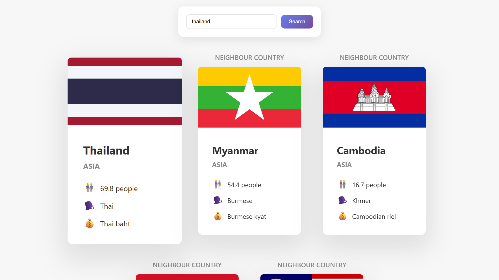

# 🌍 Neighbour Country Search App

A sleek and intuitive country search application powered by the **REST Countries API**.
Search for any country to instantly view rich data including population, language, currency, and all its neighboring nations — beautifully displayed using responsive UI cards.

> Built to strengthen skills in **asynchronous JavaScript**, **API integration**, and **modern DOM manipulation**.

---

## 🌐 Live Demo

👉 [**Try the App**](https://nkieu-neighbour-search.vercel.app/)

> 📝 Try typing: `Thailand`, `Brazil`, `Egypt`, or `Germany`

---

## 📸 Screenshots



---

## ✨ Features

- 🔍 **Country Search by Name**
  Enter any country name to retrieve real-time details.

- 🏳️ **Rich Visual Country Cards**
  Displays flag, population, language, region, and currency.

- 🌐 **Neighbour Discovery**
  Automatically fetches and displays bordering countries.

- ⚠️ **Smart Error Handling**
  Provides clear feedback when a country isn't found or input is invalid.

- ⌨️ **Keyboard Accessibility**
  Press `Enter` to trigger the search without using a mouse.

---

## 🧠 What I Learned

This project helped reinforce:

- ✅ Writing clean, reusable **async/await** logic
- ✅ Error handling with **try/catch** and graceful fallbacks
- ✅ DOM rendering with `insertAdjacentHTML` for dynamic components
- ✅ **Destructuring**, **optional chaining**, and **template literals**
- ✅ Managing dependent async requests with `Promise.all`

---

## 🛠️ Tech Stack

| Technology             | Purpose                                         |
| ---------------------- | ----------------------------------------------- |
| **HTML5**              | Semantic structure for inputs and results       |
| **CSS3**               | Responsive layout and card design               |
| **JavaScript (ES6+)**  | Core logic, modern syntax, and async operations |
| **REST Countries API** | External API used to fetch country data         |

---

## 🚀 Getting Started

### 🖥️ Run Locally

```bash
git clone https://github.com/nkieu-config/neighbour-search-app.git
```

Then open `index.html` in your browser.

> ✅ No frameworks or dependencies required — just open and use.

---

## 💡 How to Use

1. **Type a country name** into the input field.
2. Click **“Search”** or press **Enter**.
3. Instantly view:

   - Flag
   - Population
   - Language
   - Currency
   - Region

4. If available, **neighboring countries** will also appear beside it.

---

## 🌐 API Reference

This app uses the [REST Countries API](https://restcountries.com/) to fetch live country data:

| Endpoint                    | Purpose                  |
| --------------------------- | ------------------------ |
| `/v3.1/name/{country}`      | Search by country name   |
| `/v3.1/alpha/{countryCode}` | Lookup neighbors by code |

---

## 📘 Project Source

Created as part of:
🎓 [_The Complete JavaScript Course_](https://www.udemy.com/course/the-complete-javascript-course/)
by [Jonas Schmedtmann](https://codingheroes.io)

---

## ⚠️ Disclaimer

This project was created for **educational purposes only**.
It is not intended for production or commercial use.

---

## 📌 License

Open-source under the [MIT License](LICENSE)
